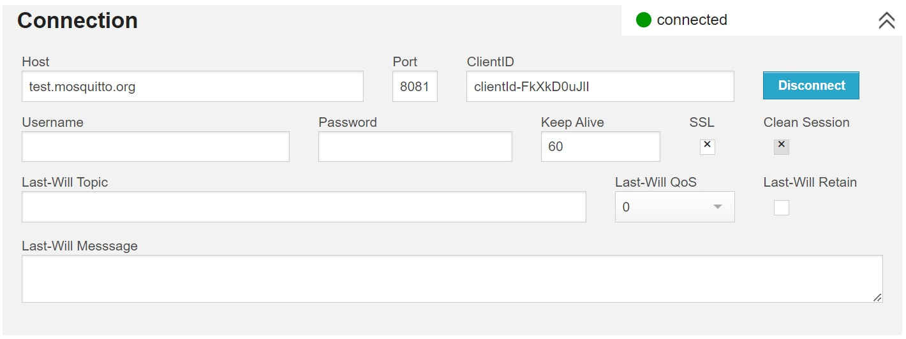
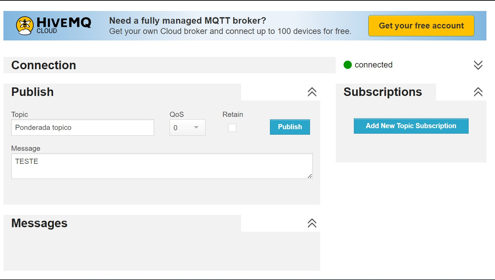
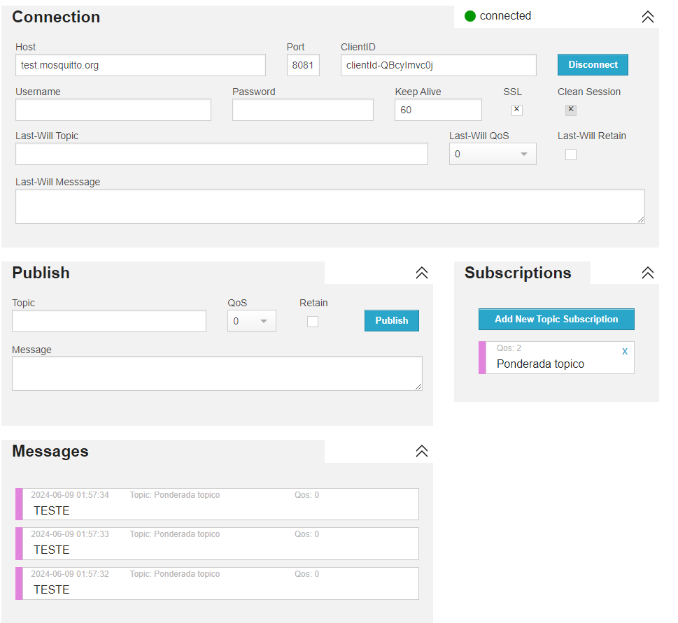

### José Vitor Marcelino, Rafael Techio, Luiz Covas

# O que é MQTT

MQTT (Message Queuing Telemetry Transport) é um protocolo de comunicação leve e eficiente, projetado para ser utilizado em redes com baixa largura de banda, alta latência ou redes intermitentes. Originalmente desenvolvido pela IBM, o MQTT é amplamente utilizado em aplicações de Internet das Coisas (IoT) devido à sua simplicidade e eficiência. Ele opera sobre o protocolo TCP/IP e utiliza um modelo de publicação/assinatura (pub/sub), onde dispositivos podem publicar mensagens em tópicos específicos ou assinar-se a esses tópicos para receber mensagens. Sua leveza e confiabilidade o tornam ideal para conectar dispositivos remotos com baixa capacidade de processamento e conexão instável.

# Exemplo de Conexão MQTT Pública utilizando o HiveMQ

Neste exemplo, vamos configurar uma conexão MQTT pública utilizando o HiveMQ, um dos brokers MQTT mais populares. O HiveMQ oferece uma infraestrutura robusta e segura para a comunicação MQTT, permitindo testes e implementações rápidas. Atuarei como um publicador de tópico, ou seja, enviarei mensagens para um tópico específico. Para isso, utilizaremos as ferramentas e o broker público disponibilizado pelo HiveMQ, que nos permitirá publicar mensagens sem a necessidade de uma infraestrutura própria.

# Funcionamento da Subscription e Atuação como Subscriber

No MQTT, a subscription (ou assinatura) é o processo pelo qual um cliente se inscreve em um tópico específico para receber mensagens publicadas naquele tópico. Quando um cliente se inscreve em um tópico, ele começa a receber todas as mensagens enviadas para esse tópico pelo publicador. Neste exemplo, também atuarei como um subscriber do tópico de teste que criamos, o que significa que estarei recebendo todas as mensagens que foram publicadas naquele tópico. Essa funcionalidade é essencial para muitos cenários de IoT, onde dispositivos precisam receber dados em tempo real de outros dispositivos ou sensores.

# Possíveis vulnerabilidades: Confidencialidade, Disponibilidade, Integridade

## Ataque de confidencialidade:

Como qualquer pessoa pode se conectar a um broker público, todos podem ver as mensagens inseridas em algum tópico. Dessa forma, é simples explorar falhas de vulnerabilidade de confidencialidade, caso o sistema não esteja usando criptografia adequada para a comunicação.

Passo a passo:
- O atacante identifica um tópico que está sendo usado para comunicação de um sistema
- O atacante identifica as mensagens
- Caso houver uma criptografia fraca, o atacante identifica qual é e a quebra.
- As mensagens são capturadas e interpretadas pelo atacante.

## Ataque de Disponibilidade:

Como o broker e o tópico são públicos, qualquer pessoa pode enviar mensagens para o tópico. Se cada mensagem enviada é processada por um listener, isso quer dizer que há a possibilidade de realizar uma negação de serviço ao enviar diversas mensagens por um longo período de tempo, possivelmente "derrubando" o servidor que está processando as mensagens.

Passo a passo:
- O atacante identifica um tópico que está sendo usado para comunicação de um sistema
- Um script para criação de mensagens é executado
- O servidor listener tenta processar todas as mensagens
- Possivelmente o servidor consome todos os recursos computacionais e torna-se inativo

## Ataque de Integridade:

Pelo fato da comunicação ser pública, qualquer pessoa pode ver e inserir mensagens no tópico público. Desse modo, caso não exista uma criptografia de trânsito entre o publisher e o consumer, é possível inserir mensagens que explorem vulnerabilidades no sistema com dados falsos, por exemplo.

Passo a passo:
- O atacante identifica um tópico que está sendo usado para comunicação de um sistema
- O atacante identifica o padrão de comunicação usado
- O atacante insere mensagens com dados maliciosos utilizando do padrão
